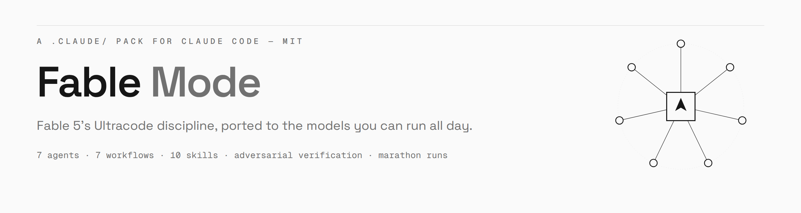
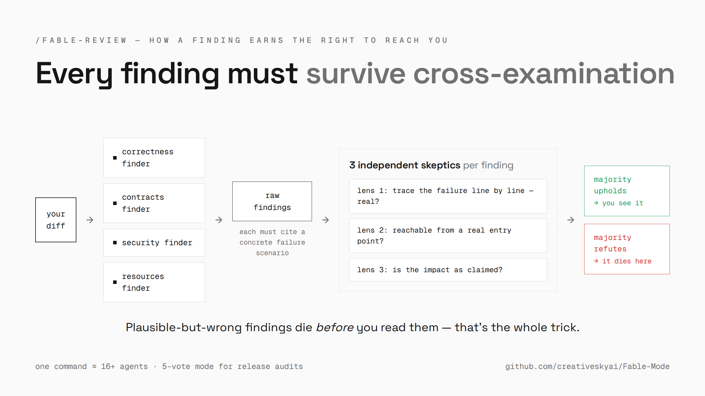
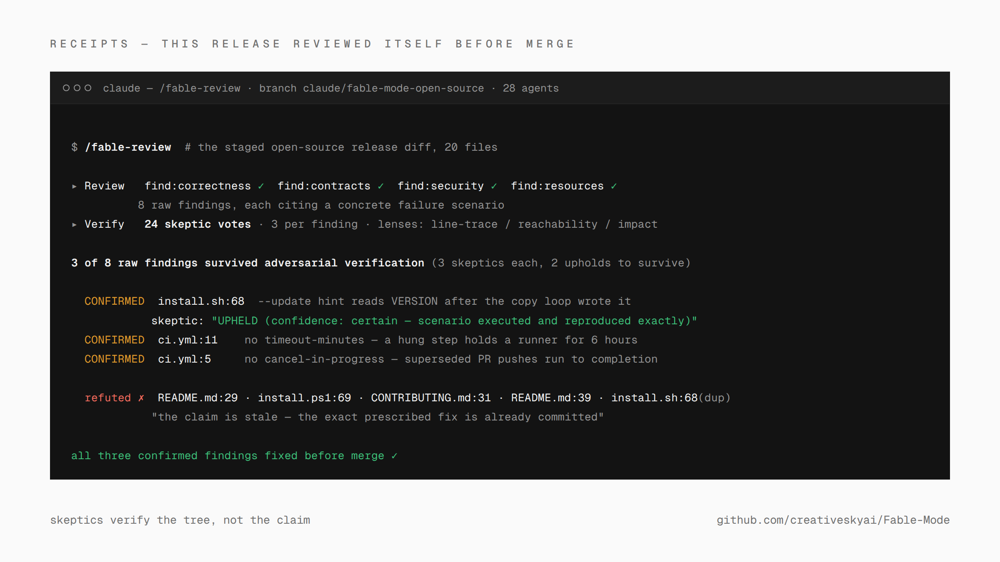
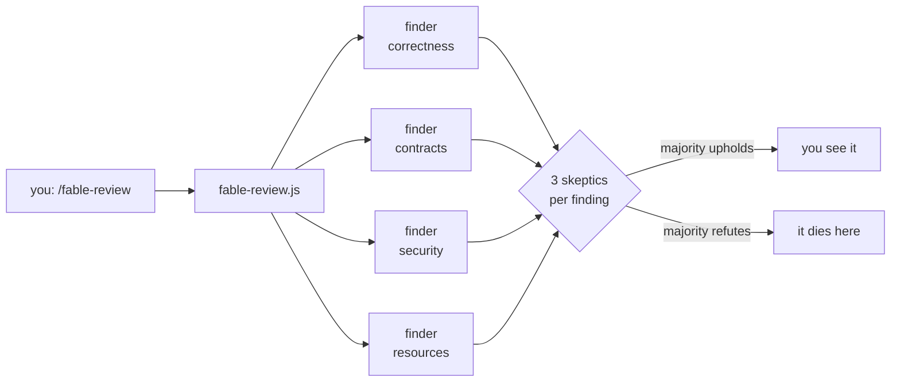

<div align="center">



[](https://github.com/creativeskyai/Fable-Mode/actions/workflows/ci.yml)
[](LICENSE)
[](https://claude.com/claude-code)
[](#which-model-should-drive)

**[Install](#install) · [See it work](#see-it-work) · [Commands](#the-commands) · [How it works](#how-it-works) · [Marathon](#continuous-operation-fable-marathon) · [Models](#which-model-should-drive) · [FAQ](#faq)**

</div>

---

Claude Fable 5 is Anthropic's Mythos-class model, built to run in an agent harness for days at a time: planning across stages, delegating to subagents, checking its own work. Most of us drive Opus, Sonnet, or Haiku day to day.

Fable Mode ports that working style to the model you already run. Every substantive task becomes an orchestrated fleet. Every finding is attacked by independent skeptics before you see it. Discovery loops until it runs dry. Long jobs survive crashes, compactions, and new sessions. One `.claude/` folder, two installer scripts, zero dependencies, MIT.

The insight the pack is built on: most of what makes Fable-grade output trustworthy is process, and process is portable. Independent perspectives, skeptics that kill plausible-but-wrong claims before you read them, completeness critics, and reports that say exactly what was and wasn't covered. The pack ships that process as structure your model runs through, whichever model it is.

Claude Code's own `ultracode` setting (Opus 4.8 / Sonnet 5, v2.1.203+) grants xhigh effort plus standing permission to orchestrate. What it doesn't ship is a *doctrine*: what the fleets should do with that permission, what verification means, when a hunt is done, when to stop and ask you. That doctrine is this pack. It composes with ultracode where you have it, and supplies the structure everywhere else, including on Haiku, which has no xhigh at all.

## See it work

With the doctrine wired in you don't run commands. You ask for work in plain language and the model orchestrates on its own; the skills exist for when you want specific machinery at a specific scale. Here is the trial every `/fable-review` finding has to survive:



The step most packs skip is the second one: **every raw finding goes on trial before it reaches you.** Three skeptics per finding, each judging through a different lens (trace it line by line; is it reachable from a real entry point; is the impact as claimed), majority verdict. A plausible-but-wrong finding dies in the pipeline instead of costing you twenty minutes of disproving it yourself.

This very release was reviewed by its own fleet before merge. 28 agents, 8 raw findings, 3 survived cross-examination (one installer bug a skeptic reproduced live, two CI gaps), all fixed before merge. The five refuted claims died because skeptics verify the tree, not the finder's word:



## Install

From a clone, into any project (the installer never overwrites existing files):

```bash
# macOS / Linux
tmp="$(mktemp -d)" && git clone --depth 1 https://github.com/creativeskyai/Fable-Mode.git "$tmp/fable-mode"
"$tmp/fable-mode/install.sh" /path/to/your/project
```

```powershell
# Windows
$tmp = Join-Path $env:TEMP "fable-mode-$(Get-Random)"
git clone --depth 1 https://github.com/creativeskyai/Fable-Mode.git $tmp
& "$tmp\install.ps1" C:\path\to\your\project
```

That copies the `.claude/` assets and adds one line to the target's `CLAUDE.md`:

```markdown
# Fable Mode
@.claude/fable/FABLE.md
```

Manual install is those same two steps done by hand. If you'd rather not touch `CLAUDE.md`, skip the import and run `/fable` at the start of a session instead.

> [!IMPORTANT]
> **Restart any open Claude Code session in the target project after installing.** Agent types register at session start and don't hot-reload. (Workflows survive an unregistered agent by falling back to the default agent type, with a log line telling you to restart.)

To update an installed project later, re-run the installer with `--update` / `-Update`: it refreshes every pack-owned file to the current version and touches nothing else. Your own agents, skills, and settings are never modified, but it does overwrite tuning edits you made *inside* pack files, so commit first and re-apply from the diff. The installed version is readable at `.claude/fable/VERSION`; changes per version are in [CHANGELOG.md](CHANGELOG.md).

<details>
<summary><b>Uninstall</b> (two steps, no script)</summary>

1. Remove the `# Fable Mode` heading and the `@.claude/fable/FABLE.md` import line from the project's `CLAUDE.md` (delete the file if the installer created it and you added nothing else).
2. Delete the pack's files. Everything is namespaced `fable*` except the `ultra` skill:

```bash
rm -rf .claude/fable .claude/skills/ultra .claude/skills/fable*
rm -f .claude/agents/fable-*.md .claude/workflows/fable-*.js
```

```powershell
Remove-Item -Recurse -Force .claude\fable, .claude\skills\ultra
Get-ChildItem .claude\agents\fable-*.md, .claude\workflows\fable-*.js | Remove-Item
Get-ChildItem .claude\skills -Directory -Filter fable* | Remove-Item -Recurse -Force
```

</details>

## The commands

| Your question | Run | What happens |
|---|---|---|
| "Build X" (substantive, end to end) | `/ultra` | understand → design → implement → review, full pipeline |
| "How is this codebase organized?" | `/fable-understand` | partition, parallel deep-reads, one cited architecture brief |
| "Where is X handled? What breaks if I change Y?" | `/fable-research` | 5 search modalities, cited answer, completeness critic |
| "How should I build X?" (decision only) | `/fable-plan` | 3 divergent designs, judge panel, synthesized plan |
| "Review this diff / branch / PR" | `/fable-review` | 4 finder dimensions, every finding attacked by skeptics |
| "Find ALL the bugs / audit this module" | `/fable-exhaust` | rounds of diverse finders until two rounds come up dry |
| "Apply this change everywhere" | `/fable-migrate` | discover every site, pilot on 2 files, transform + verify each |
| "Are we ready to release?" | `/fable-ship` | project checks + hygiene + docs, then a skeptic attacks "ready" |
| "Keep working on this for hours/days" | `/fable-marathon` | continuous verified cycles with a persistent run file |
| Doctrine isn't loaded (fresh clone) | `/fable` | loads the operating contract mid-session |

The one command whose stopping rule deserves a sentence is `/fable-exhaust`: a fixed number of sweeps is a guess about how much there is to find, so it keeps launching differently-angled finder waves until two consecutive rounds surface nothing new, then stops on that evidence.

A one-page routing guide (what to run when, look-alikes disambiguated, cost feel per command) ships with the pack as [`.claude/fable/GUIDE.md`](.claude/fable/GUIDE.md), so it's in every project you install into.

## How it works

One folder, four layers, wired by string name, with a [checker](tools/check-workflows.cjs) in CI that keeps every name resolving:

```
.claude/
├── fable/FABLE.md        the doctrine — always-on operating contract, imported into CLAUDE.md
├── skills/               10 slash commands (the layer you touch)
├── workflows/            7 deterministic fan-out scripts for Claude Code's Workflow tool
└── agents/               7 specialists the fleets are built from
```

| Agent | Role |
|---|---|
| `fable-scout` | reads and maps territory (read-only) |
| `fable-finder` | hunts defects, each backed by a concrete failure scenario |
| `fable-skeptic` | adversarial verifier: weighs claims both ways, kills the wrong ones |
| `fable-judge` | scores candidates on one rubric, grounded in the code |
| `fable-builder` | precisely-scoped edits, self-verified |
| `fable-critic` | completeness critic: finds what's missing |
| `fable-scribe` | synthesizes fan-out results into one readable report |



Every workflow announces every bound it applies (round caps, lead caps, budget stops), so a stopped run always says what it skipped. The doctrine writes this down as a rule: `no silent caps`.

### How it maps to Fable 5 Ultracode

| Ultracode behavior | Pack mechanism |
|---|---|
| Workflow orchestration by default | standing authorization in `FABLE.md`, plus per-skill opt-in |
| Adversarial verify (N refuting skeptics, majority kills) | `fable-review` verify stage; `fable-skeptic` agent |
| Perspective-diverse verification | three-lens panels in `fable-review` and `fable-exhaust` |
| Judge panel for wide solution spaces | `fable-design` + `fable-judge` (rotated presentation order per judge) |
| Loop-until-dry discovery | `fable-exhaust` (2 consecutive dry rounds to stop) |
| Multi-modal sweep | `fable-research` (names, content, structure, history, tests) |
| Completeness critic | `fable-critic`; final stage of `fable-research` |
| Token-budget awareness (`+500k` directives) | `fable-exhaust` checks `budget.remaining()` each round |
| Long-running autonomous work | `/fable-marathon` + `FABLE-RUN.md` state file; composes with `/loop` |
| Release gating before deploys | `fable-ship` (verifies readiness; never deploys) |

## Continuous operation (`/fable-marathon`)

Built for overnight and multi-day runs. All state lives in `FABLE-RUN.md` at the project root: goal, backlog with machine-checkable `done-when:` commands, journal, next action. It's created automatically and committed at every verified milestone, so **any session resumes from the file alone**, across crashes, compactions, or machines. Each cycle executes one backlog item through the full phase discipline and checkpoints.

Three disciplines keep unattended runs honest:

- **Walls** — actions that always queue for you (secrets, payments, deploys, anything destructive), written into the run file so they survive compaction.
- **Invariants** — finished items graduate into cheap re-runnable check commands that every cycle re-verifies, so nothing that passed once rots silently.
- **The standoff rule** — when implementation and verification reject the same fix twice, the item blocks for you instead of burning tokens all night.

For unattended operation, compose it with whatever loop mechanism your Claude Code provides:

```
/loop /fable-marathon        # self-paced recurring cycles
/loop 30m /fable-marathon    # fixed interval
```

or point a scheduled task at the same command. Where your Claude Code has `/goal`, a backlog item's `done-when:` command doubles as the goal condition. Marathon stops on its own only for things that are yours: an empty backlog, a question only you can answer, or a deploy-shaped action (gated behind `/fable-ship` and handed to you).

## Which model should drive?

The pack is model-agnostic. Agents ship with `model: inherit`, so everything runs on your session model. What changes per model is what the structure buys you:

| Session model | Sweet spot | What the pack adds |
|---|---|---|
| **Opus 4.8** | design-heavy features, audits, overnight marathons | breadth: panels and skeptic votes catch what even a strong single pass misses |
| **Sonnet 5** | the daily driver: reviews, research, migrations | rigor: Ultracode-style verification at run-all-day prices |
| **Haiku 4.5** | scoped questions, mechanical migrations | honesty: the discipline reports gaps a small model would otherwise gloss over |

Three practical notes:

- On Opus 4.8 and Sonnet 5 (Claude Code v2.1.203+), `/effort ultracode` pairs naturally with the pack: ultracode supplies the effort and the standing permission, Fable Mode supplies the process. On Haiku 4.5 there is no xhigh, so the pack's structure is the whole game there.
- Per-agent model pinning in agent frontmatter (e.g. scouts on Haiku) is the intended tuning lever, **but Claude Code currently ignores that field** ([#44385](https://github.com/anthropics/claude-code/issues/44385)): subagents inherit the session model regardless. The shipped files stay on `inherit` deliberately.
- Reasoning effort is the better lever today: the Workflow tool accepts per-agent `effort` overrides. Spend it where the loop branches (skeptics and judges) and keep mechanical stages at default. The shipped workflows set no overrides; see [Tuning](#tuning).

## Tuning

- **Verification strictness** — `votes` in the review workflow (3 default, 5 for audits); dry-round threshold and `MAX_ROUNDS` in `fable-exhaust`.
- **Per-stage effort** — workflow agents inherit the session's reasoning effort; pass `effort: 'high'` on skeptic/judge stages if you want the loop's branch points thinking harder.
- **Doctrine** — `FABLE.md` is plain markdown; edit the scale dial or reporting rules to taste. It loads into every session, so keep it lean.
- **Cost control** — the scale dial is the main lever: "quick" or "no agents" in your request drops to solo work; "thorough" / "audit" scales up. A budget you state ("+500k") is a hard cap. Prefer `/fable-research` (one bounded sweep) over `/fable-exhaust` (loops until dry) for scoped questions.

### What the pack reads from your repo, if present

Workflows treat your project's own operating docs as authoritative before self-detecting anything: the root `CLAUDE.md` plus every file it imports via `@path` lines, `AGENTS.md`, a decision log at `DECISIONS.md` or `docs/DECISIONS.md` (entries marked **Locked** are settled constraints that reviewers cite instead of relitigating), and `FABLE-RUN.md`'s Walls. Nothing is required: a project that documents none of this gets plain self-detection (package.json scripts, Makefile, CI config). Document your commands once, in your own files, and every fleet uses them.

## Requirements

| Your Claude Code | What you get |
|---|---|
| Workflow tool available (documented floor: v2.1.154+, paid plan) | the full experience: named workflows, deterministic orchestration |
| Agent tool only | the same structures via each skill's shipped fallback: parallel subagents, same stages, less deterministic control flow |
| Neither | doctrine-only via `/fable`: phase discipline and reporting standards, solo execution |

Two things worth knowing going in:

- **You're trading tokens for verification.** Costs and the levers that control them are in the [FAQ](#faq).
- **What hot-reloads:** skills and workflow scripts are read at invocation, so edits apply immediately. Agents and the `CLAUDE.md` import load at session start and need a restart.

## FAQ

<details>
<summary><b>Is this a plugin? Do I need a marketplace?</b></summary>

No. It's a drop-in `.claude/` configuration pack, not a marketplace plugin, and it coexists fine with any plugins you already use. No plugin manager, no npm, no build step. It works anywhere Claude Code reads project configuration: CLI, desktop, web, IDE extensions.
</details>

<details>
<summary><b>Will it fight my existing CLAUDE.md or agents?</b></summary>

It adds one import line and namespaced files (`fable-*`, plus `/ultra`), and the installer never overwrites anything that exists. Your explicit instructions always override the doctrine; that rule is written into the doctrine itself.
</details>

<details>
<summary><b>What does a run actually cost?</b></summary>

Orchestration multiplies agents: `/fable-review` is ~16+ agents, `/fable-exhaust` can be dozens across rounds. Every workflow logs every bound it applies, and "quick" in your request drops to solo work. If you state a token budget, it's treated as a hard cap.
</details>

<details>
<summary><b>Does it make my model as good as Fable 5?</b></summary>

It makes your model's *work* go through the same gauntlet Fable's does: mapped before designed, reviewed by agents that didn't write it, hunted until dry, reported without gaps glossed over. On hard problems, that process accounts for a large share of the difference you can see in the output, even though the weights stay yours.
</details>

<details>
<summary><b>Does it work outside Claude Code?</b></summary>

The doctrine, agents, and skills port reasonably (they're markdown); the workflow scripts are Claude-Code-specific (the Workflow tool's JS sandbox). Every skill ships an Agent-tool fallback that emulates its stages, and on hosts that read `.claude/` directories that fallback becomes the primary path. First-class support for other harnesses is open for discussion in the issues.
</details>

<details>
<summary><b>Can I adopt just one piece?</b></summary>

Yes. `/fable` loads doctrine only. Any skill works standalone. The seven agents are directly usable from the Agent tool without any workflow. Delete what you don't want; everything is namespaced.
</details>

<details>
<summary><b>If a run dies mid-flight?</b></summary>

Workflows are stateless between invocations: re-invoke the skill, narrowing the args to what's still unanswered; no repo state is lost. `/fable-marathon` resumes from `FABLE-RUN.md` alone. "Agent type not found" everywhere means the pack was just installed: restart the session (runs still complete via the default-agent fallback in the meantime).
</details>

## Contributing

The wiring is strict and the checker enforces it. Read [CONTRIBUTING.md](CONTRIBUTING.md) before your first PR. Security reports: [SECURITY.md](SECURITY.md).

If Fable Mode killed a bad merge for you, that's a good reason to star the repo. It's how the next person finds it.

<div align="center">

<picture>
  <source media="(prefers-color-scheme: dark)" srcset="https://api.star-history.com/svg?repos=creativeskyai/Fable-Mode&type=Date&theme=dark">
  <source media="(prefers-color-scheme: light)" srcset="https://api.star-history.com/svg?repos=creativeskyai/Fable-Mode&type=Date">
  
</picture>

</div>

## License

[MIT](LICENSE) © 2026 [CreativeSky AI](https://creativesky.ai)

*Fable Mode is a community project, not affiliated with or endorsed by Anthropic. "Claude" is a trademark of Anthropic, PBC. The pack ports a working style; it does not change what your model can do.*
