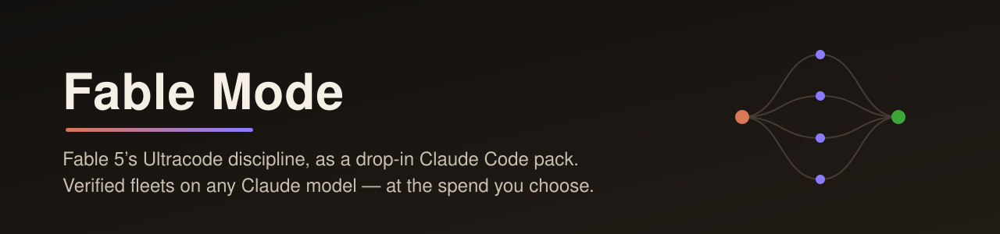
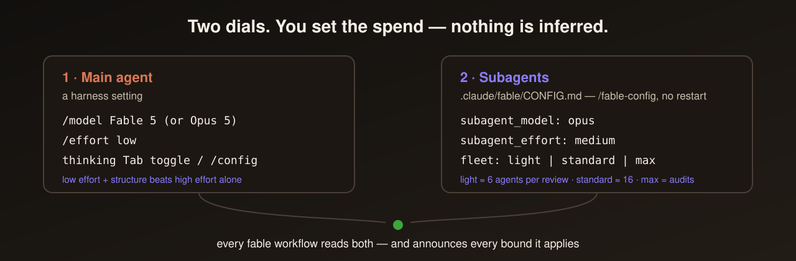
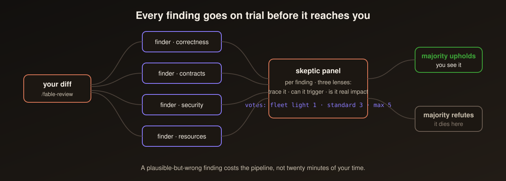
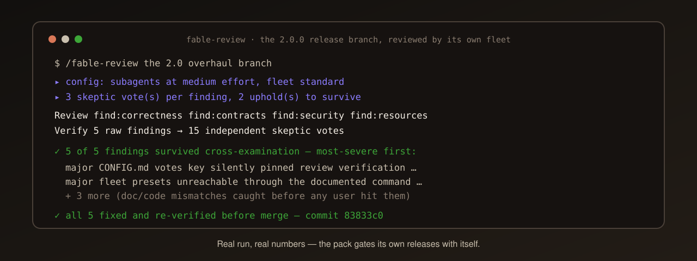

<div align="center">



[](https://github.com/creativeskyai/Fable-Mode/actions/workflows/ci.yml)
[](LICENSE)
[](https://claude.com/claude-code)
[](#the-value-setup)

**[Install](#install) · [The value setup](#the-value-setup) · [Config](#config) · [Commands](#the-commands) · [How it works](#how-it-works) · [FAQ](#faq)**

</div>

---

Fable Mode is a drop-in `.claude/` pack that gives any Claude Code project the working style of Claude Fable 5 running Ultracode: every substantive task becomes an orchestrated fleet, every finding is attacked by independent skeptics before you see it, discovery loops until it runs dry, and long jobs survive crashes and new sessions. One folder, two installer scripts, zero dependencies, MIT.

What's new in 2.0: **you set the spend in a config file instead of hoping the model infers it.** Subagent model, subagent effort, fleet size, and verification votes live in `.claude/fable/CONFIG.md`, changeable mid-session with `/fable-config`. The defaults are tuned for value, not token burn — benchmarks keep showing that lower effort with structural verification beats higher effort without it.

## Install

From a clone, into any project (never overwrites existing files):

```bash
# macOS / Linux
tmp="$(mktemp -d)" && git clone --depth 1 https://github.com/creativeskyai/Fable-Mode.git "$tmp/fable-mode"
"$tmp/fable-mode/install.sh" /path/to/your/project
```

```powershell
# Windows
$tmp = Join-Path $env:TEMP "fable-mode-$(Get-Random)"
git clone --depth 1 https://github.com/creativeskyai/Fable-Mode.git $tmp
& "$tmp\install.ps1" C:\path\to\your\project
```

That copies `.claude/**`, adds one import line to the target's `CLAUDE.md`, and — on first install only — creates `.claude/settings.json` pre-approving the **Workflow** and **Agent** tools, so fleet launches don't prompt (that's the standing authorization you're opting into; delete the file to opt out — everything agents *do* still runs under your normal permission mode). If you already have a `settings.json`, it's left untouched and the installer prints the two entries to add. Then **restart any open Claude Code session in that project** — agents register at session start.

To update later, re-run with `--update` / `-Update`: it refreshes pack files, never touches your own files, and never overwrites your `CONFIG.md`. Version at `.claude/fable/VERSION`; changes in [CHANGELOG.md](CHANGELOG.md).

<details>
<summary><b>Uninstall</b></summary>

1. Remove the `# Fable Mode` heading and `@.claude/fable/FABLE.md` line from the project's `CLAUDE.md`.
2. If the installer created your `.claude/settings.json`, delete it (or just remove the `"Workflow"` / `"Agent"` entries if you've added your own since).
3. Delete the pack files (everything is namespaced `fable*` except `/ultra`):

```bash
rm -rf .claude/fable .claude/skills/ultra .claude/skills/fable*
rm -f .claude/agents/fable-*.md .claude/workflows/fable-*.js
```
</details>

## The value setup



Two dials. The main agent is a harness setting; the subagents are the pack's config.

| | Set with | Recommended |
|---|---|---|
| **Main agent** | `/model`, `/effort`, thinking via Tab or `/config` | **Fable 5 at low effort** (or Opus 5) |
| **Subagents** | `.claude/fable/CONFIG.md`, via `/fable-config` | **Opus at medium effort** (the shipped default) |

Why low effort on the driver: the pack's structure — independent finders, skeptics that refute, completeness critics — does the verification that high effort tries to do with more thinking. You get Ultracode-shaped results faster and cheaper. Turn effort (or thinking) back up only for genuinely hard single-brain reasoning; `/fable-config max` when you want audit-grade verification instead.

## Config

`.claude/fable/CONFIG.md` sets the defaults every fable command runs with:

```yaml
subagent_model: opus     # fable | opus | sonnet | haiku | inherit (= session model)
subagent_effort: medium  # low | medium | high | xhigh | inherit
fleet: standard          # light | standard | max — scales pools, votes, round caps
# votes: 3               # uncomment to pin the skeptic count instead of the fleet's (1/3/5)
```

Change it any time — applies to the next command, no restart:

```
/fable-config                        # show current settings
/fable-config fleet light            # fewer agents, 1 skeptic per finding
/fable-config subagent_model haiku   # cheap subagents
/fable-config max                    # audit mode: opus/high, 5 votes
/fable-config value                  # back to the shipped defaults
```

Words in a request still override for one run: "quick" or "no agents" drops to solo work, "thorough" or "audit" scales to fleet max, and a stated budget ("+500k") is a hard cap. Every workflow announces every bound it applies — a stopped run always says what it skipped.

## The commands

| Your question | Run | What happens |
|---|---|---|
| "Build X" (substantive, end to end) | `/ultra` | understand → design → implement → review |
| "How is this codebase organized?" | `/fable-understand` | parallel deep-reads, one cited brief |
| "Where is X handled? What breaks if I change Y?" | `/fable-research` | 5 search modalities, cited answer, completeness critic |
| "How should I build X?" (decision only) | `/fable-plan` | divergent designs, judge panel, synthesized plan |
| "Review this diff / branch / PR" | `/fable-review` | 4 finder dimensions, every finding attacked by skeptics |
| "Find ALL the bugs / audit this" | `/fable-exhaust` | finder waves until two rounds come up dry |
| "Apply this change everywhere" | `/fable-migrate` | discover every site, pilot on 2 files, transform + verify |
| "Are we ready to release?" | `/fable-ship` | project checks + hygiene + docs, skeptic attacks "ready" |
| "Keep working on this for hours/days" | `/fable-marathon` | verified cycles with a persistent run file |
| Change the defaults | `/fable-config` | edits CONFIG.md, shows presets |
| Doctrine isn't loaded | `/fable` | loads the operating contract mid-session |

Mostly, though, you run nothing: the doctrine is in every session's context and the model orchestrates on its own. A one-page routing guide ships with the pack as [`.claude/fable/GUIDE.md`](.claude/fable/GUIDE.md).

## How it works

One folder, five layers, wired by string name, with a [checker](tools/check-workflows.cjs) in CI that keeps every name resolving:

```
.claude/
├── fable/FABLE.md      the doctrine — always-on contract, imported into CLAUDE.md
├── fable/CONFIG.md     your defaults — read at invocation, passed into every workflow
├── skills/             11 slash commands (the layer you touch)
├── workflows/          7 deterministic fan-out scripts for the Workflow tool
└── agents/             7 specialists: scout, finder, skeptic, judge, builder, critic, scribe
```

The step most packs skip: **every raw finding goes on trial before it reaches you.** Skeptics judge each finding through different lenses (trace it line by line; is it reachable; is the impact real), majority verdict. A plausible-but-wrong finding dies in the pipeline instead of costing you twenty minutes.



A real run of this pipeline over the 2.0.0 release branch itself — 4 finders, 5 raw findings, 15 skeptic votes, all 5 confirmed and fixed before merge:



For long jobs, `/fable-marathon` keeps all state in `FABLE-RUN.md` at the project root — goal, walls (actions that always queue for you), backlog with machine-checkable `done-when:` commands, journal — committed at every verified milestone, so any session resumes from the file alone. Unattended: `/loop /fable-marathon` or a scheduled task.

## Requirements

| Your Claude Code | What you get |
|---|---|
| Workflow tool (v2.1.154+, paid plan) | the full experience: named workflows, deterministic orchestration |
| Agent tool only | the same stages via each skill's shipped fallback |
| Neither | doctrine-only via `/fable`: phase discipline, solo execution |

Skills, workflows, and CONFIG.md hot-reload at invocation. Agents and the CLAUDE.md import load at session start — restart after installing.

## FAQ

<details>
<summary><b>Is this a plugin? Do I need a marketplace?</b></summary>

No. It's a drop-in `.claude/` configuration pack. No plugin manager, no npm, no build step. Works anywhere Claude Code reads project config: CLI, desktop, web, IDE extensions.
</details>

<details>
<summary><b>Will it fight my existing CLAUDE.md or agents?</b></summary>

It adds one import line and namespaced files, and the installer never overwrites anything that exists. Your explicit instructions always override the doctrine — that rule is written into the doctrine itself.
</details>

<details>
<summary><b>What does a run cost?</b></summary>

Orchestration multiplies agents: `/fable-review` is ~16 agents at standard fleet (4 finders, 3 skeptics per finding) and roughly a third of that at light (2 finders, 1 skeptic per finding). The config is the dial — `/fable-config fleet light` shrinks every workflow's pools, votes, and caps. "Quick" in a request drops to solo work; a stated token budget is a hard cap.
</details>

<details>
<summary><b>Does it make my model as good as Fable 5?</b></summary>

It makes your model's *work* go through the same gauntlet: mapped before designed, reviewed by agents that didn't write it, hunted until dry, reported without gaps glossed over. On hard problems that process accounts for a large share of the visible difference — the weights stay yours.
</details>

<details>
<summary><b>If a run dies mid-flight?</b></summary>

Re-invoke the skill with narrower args; no repo state is lost. Marathon resumes from `FABLE-RUN.md` alone. "Agent type not found" everywhere means a fresh install — restart the session (runs still finish via a fallback meanwhile).
</details>

<details>
<summary><b>Does it work outside Claude Code?</b></summary>

The doctrine, agents, and skills are markdown and port reasonably; the workflow scripts are Claude-Code-specific. Every skill ships an Agent-tool fallback that becomes the primary path on hosts without the Workflow tool.
</details>

## Contributing

The wiring is strict and the checker enforces it — read [CONTRIBUTING.md](CONTRIBUTING.md) first. Security reports: [SECURITY.md](SECURITY.md). If Fable Mode killed a bad merge for you, star the repo — it's how the next person finds it.

## License

[MIT](LICENSE) © 2026 [CreativeSky AI](https://creativesky.ai)

*Fable Mode is a community project, not affiliated with or endorsed by Anthropic. "Claude" is a trademark of Anthropic, PBC. The pack ports a working style; it does not change what your model can do.*
